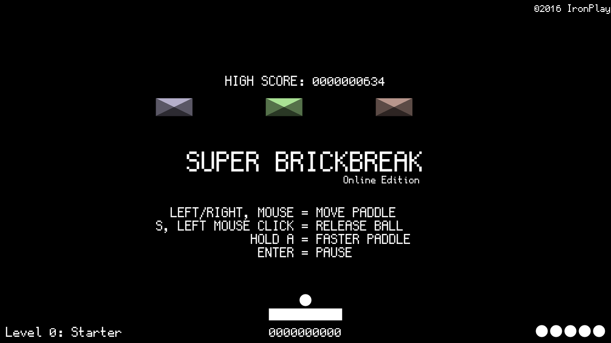

SUPER BRICKBREAK - Online Edition
================
by Lucas Vieira (luksamuk) 
Copyright (c) 2016-2018 Lucas Vieira.

**NOTE: For this game's WebAssembly counterpart, check out [this repository](https://github.com/luksamuk/super-brickbreak-rs).**

Fast-paced breakout clone featuring 20+ levels - online version.

This game is a direct port of its C++ counterpart (found in my MiniGames repo),
and part of a collection of mini-games I made in the past.
This game was originally written in Processing (Java), then ported to C++ (OficinaFramework/OpenGL), and now completely ported to JavaScript, using a 2D canvas element.
While rather simple, this is a very complete game that isn't easy nor hard; it has a score system (complete with local storage of highscore), chain bonus multipliers, and bonus points for some actions.

Please don't be a douche; do not deliberately steal this.
You can use the code as reference for your own games, as long as you respect the license.
This game uses [GohuFont](font.gohu.org) by Hugo Chargois, ported to TTF by [Guilherme Maeda](https://github.com/koemaeda/gohufont-ttf).

To-do List
----------
Stuff that I already made:
- ~~Resize canvas when resizing screen;~~ (v1.0.1)
- ~~Add version number;~~ (v1.0.1)
- ~~Add gamepad support;~~ (v1.0.1)
- ~~Limit max screen size to 1280x720;~~ (v1.0.1)
- ~~Center canvas on page;~~ (v1.0.1)
- ~~Compensate FPS on movement;~~ (v1.0.1)
- ~~Fix block collision physics;~~ (v1.0.1)
- ~~Add 1up for every 5000 points;~~ (v1.0.1)
- ~~Add a frame border to the game;~~ (v1.0.2b)
- Add fullscreen support (persistent button) (WIP);

Stuff that I plan to add/enhance/fix:
- Add smartphone support;
- Correct bug that gives the player 500 points as highscore, right on the beginning;
- Facebook & Twitter score share button;
- Improve graphics
    - Make paddle and ball have a visual style that matches the blocks;
    - Particle effects;
- Improve paddle/ball and overall graphics so the game feels in the same visual style;
- Add CONTENT!
    - Power-ups
        - Multiball;
        - Crazy blocks level;
        - Rotating blocks level;
        - Magnetic paddle;
    - Different/interesting block gimmicks
        - Turn levels 11-20 into an actual powerup that makes blocks "crazy" for a few secs then leaves them unarranged;
    - MORE LEVELS
        - External, simple level editor;
        - External level storage;
    - Music
        - Various sound effects;
        - Level music (at least three or something like that, so the player doesn't get bored).

Idea List
---------
Stuff that I plan to execute... someday.

- Leaderboards;
- Multiplayer;
- Ghost recording/replaying;
