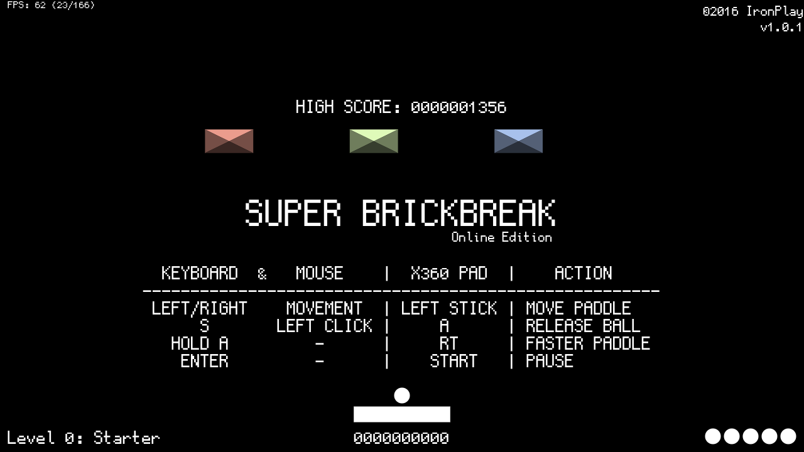

SUPER BRICKBREAK - Online Edition
================
by Lucas Vieira (luksamuk) 
Copyright (c) 2016 IronPlay Games.

Fast-paced blockbreaker clone featuring 20+ levels - online version.

This game is a direct port of its C++ counterpart (found in my MiniGames repo),
and part of a collection of mini-games I made in the past.
This game was originally written in Processing (Java), then ported to C++ (OficinaFramework/OpenGL), and now completely ported to JavaScript, using a 2D canvas element.
While rather simple, this is a very complete game that isn't easy nor hard; it has a score system (complete with local storage of highscore), chain bonus multipliers, and bonus points for some actions.

Please don't be a douche; do not deliberately steal this.
You can use the code as reference for your own games, as long as you respect the license.
This game uses [GohuFont](font.gohu.org) by Hugo Chargois, ported to TTF by [Guilherme Maeda](https://github.com/koemaeda/gohufont-ttf).

To-do List
----------
- ~~Resize canvas when resizing screen;~~ (v1.0.1)
- ~~Add version number;~~ (v1.0.1)
- ~~Add gamepad support;~~ (v1.0.1)
- Add smartphone support;
- Add 1up for every 5000 points;
- Compensate FPS on movement;
- Idea: Leaderboards;
- Idea: Multiplayer;
- Idea: Ghost recording/replaying;